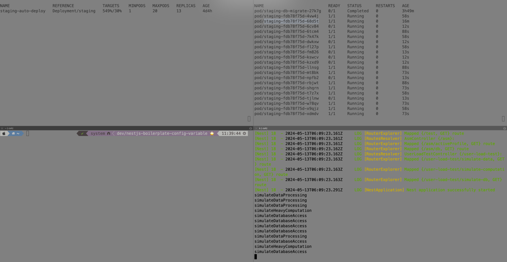

# CI/CD Notifications

## trouble shooting

* auto devops basic enable
  * 프로젝트에서 custom auto devops 코드 제거
  * 프로젝트 - ci/cd 메뉴에서 basic auto devops 사용 enable
  * gitlab registry 사용하기 ( gitlab variable 설정 )
  * Docker in Docker 에러 해결 ( CI/CD Settings → Runners → **Enable instance runners for this project** → Disable group runners )
  * branch 별 배포 되는 네임스페이스
    * main ( eks dev cluster )
      * $CI\_PROJECT\_NAME-production
    * development ( eks dev cluster )
      * $CI\_PROJECT\_NAME
    * 나머지 feature 브랜치 ( play cluster )
      * $CI\_PROJECT\_NAME-$CI\_COMMIT\_REF\_SLUG
* start, finalize stage로 구현하려고 했는데, finalize stage에서 전체 파이프라인의 성공여부를 확인할 수 있는 predefined variable이 없고 $CI\_JOB\_STATUS 값이 있어서 해당 stage의 common after script에서 저 값으로 판단하여 deploy ( review, production ) stage에서 최종 성공 여부에 대한 메시지를 전달
* start에서 이미지를 사용하지 않으면 curl 미설치 에러가 발생
  * ubuntu:latest 를 사용하고 before\_script에서 curl 설치를 했으나 어쩔땐 이 간략한 stage에서 2분이나 걸림
  * curl 만 설치된 base image 참조
    * [https://hub.docker.com/r/alpine/curl](https://hub.docker.com/r/alpine/curl)
* slack webhook url이 없는 상태인 경우 배포 pipeline이 안되는 것을 방지하기 위해서 allow\_failure : true 추가
  *   &#x20;설정을 하면 에러가 나도 스킵되고 나머지 stage가 진행됨

      <figure><figcaption></figcaption></figure>
* 메시지 간결화
  * 내가 구상한 integration 채널로 가는 게 아니라 team-prjname-integration 하나로 우선 가자고 하셔서 이에 맞게 메시지를 간결하고 직관적으로 구현

 (1).png>)


***

## 추가 개선 사항

### 성공했을 때는 프로젝트  url, 실패했을 때는 실패한 Job url을 보여주도록 개선

* deploy를 실패시키기 위해 livenessprobe를 /로 잡아놨는데 api endpoint를 바꿈

<figure><figcaption></figcaption></figure>

*  (1) (1).png>)
  * Liveness probe failed: HTTP probe failed with statuscode: 404
* 메시지 failed 확인 및 링크 누를 시 실패한 review stage로 이동 확인
  *   추후에 여기에 스레드에서 데브옵스 호출 하는 식으로

      <figure><figcaption></figcaption></figure>
  *   성공했을 때는 프로젝트 url

      <figure><figcaption></figcaption></figure>
  *   실패했을 때는 실패한 job link

      <figure><figcaption></figcaption></figure>


  *   실패했을 때 좀 더 디테일 하게 어떤 stage인 지 명시하기로 했다

      <figure><figcaption></figcaption></figure>


  * 메시지 형식 최종 수정
    * integration channel이 프로젝트별로 있는 게 아니라 프로젝트 팀 별로 있을거라서 팀에서 개발하는 프로젝트들에 대한 네이밍이 없으면 어떤 프로젝트의 배포 pipeline이 동작하는 지 알 수 없기 때문에 앞에 프로젝트 이름을 추가했다
    * `{프로젝트 repo 이름} {개발환경-prod,dev,feature branch} pipeline is started by {gitlab-user}`
      * `성공 시 프로젝트 링크`
      *   `실패 시 실패한 파이프라인 링크`

          <figure><figcaption></figcaption></figure>

          <figure><figcaption></figcaption></figure>

          <figure><figcaption></figcaption></figure>


  *   아래 명시가 되어있긴 하지만 deploy ( review, production ) 단계 시작 전 runtime log를 볼 수 있게 프로젝트 별 로그를 확인할 수 있는 loki url을 만들어서 첨부

      <figure><figcaption></figcaption></figure>

### retry 설정

*   readinessProbe 관련 문제로 review stage가 너무 길어서 retry 설정이 필요해보임

    <figure><figcaption></figcaption></figure>


* retry: max: 2 when: - always # 모든 종류의 실패에 대해 재시도 추가\

  *   이걸 하면 파드에서 retry하는 게 아니라 gitlab에서 retry 하는 설정 이었음

      <figure><figcaption></figcaption></figure>


* helm values 설정을 해봤는데 먹히지 않는다
* auto deploy values.yaml 코드를 봤는데 관련된 값이 없어서 적용이 안되는 것 같다

```yaml
livenessProbe:
  initialDelaySeconds: 30
  timeoutSeconds: 3
  periodSeconds: 5
  failureThreshold: 1
  path: /

readinessProbe:
  initialDelaySeconds: 30
  timeoutSeconds: 3
  periodSeconds: 5
  failureThreshold: 1
  path: /
```

***

### build stage에도 after script로 실패시에만 알림을 가도록 추가

1. kaniko image에서 curl이 없어서 slack 알림을 보낼 시 에러 발생
   1. nexus에 custom image를 만들어서 사용 했지만 로그인 관련 이슈 때문에 포기
   2. docker hub public repo에 push 해서 사용 했지만 실패해서 포기
   3. curl base imgae를 사용하도록 job을 분리해서 사용 시도
      1. `on_failure: true`
         1.  앞 stage ( build ) 가 실패했을 때만 동작하도록 설정

             <figure><figcaption></figcaption></figure>
         2.  성공 시 skip 되는 것 확인

             <figure><figcaption></figcaption></figure>

***

### common before script로 loki url 프로젝트 배포 환경에 맞게 전달해서 로그를 바로 볼 수 있게 개선

```yaml
.common_before_script: &common_before_script
  before_script:
    - |
      if [[ "$CI_COMMIT_REF_NAME" == "main" ]]; then
      LOG_DOMAIN=""
      elif [[ "$CI_COMMIT_REF_NAME" == "development" ]]; then
      LOG_DOMAIN=""
      else
      LOG_DOMAIN=""
      fi
      echo "Loki domain : $LOG_DOMAIN"
      LOG_URL="$LOG_DOMAIN/explore?orgId=1&left=%7B%22datasource%22:%22LokiDataSourceName%22,%22queries%22:%5B%7B%22refId%22:%22A%22,%22editorMode%22:%22builder%22,%22expr%22:%22%7Bnamespace%3D%5C%22$KUBE_NAMESPACE%5C%22%7D%22,%22queryType%22:%22range%22%7D%5D,%22range%22:%7B%22from%22:%22now-1h%22,%22to%22:%22now%22%7D%7D"
      MESSAGE=":mag_right: $CI_PROJECT_NAME deploy stage is *started* by *$GITLAB_USER_LOGIN* (<$LOG_URL|View Runtime Logs>)"
      curl -X POST -H 'Content-type: application/json' \
      --data "{\"text\":\"$MESSAGE\"}" \
      $SLACK_WEBHOOK_URL
  allow_failure: true
```

```yaml
.common_before_script: &common_before_script
  before_script:
    - |
      if [[ -z "$SLACK_WEBHOOK_URL" ]]; then
        echo "SLACK_WEBHOOK_URL is not set. Skipping Slack notification."
      else
        if [[ "$CI_COMMIT_REF_NAME" == "main" ]]; then
          LOG_DOMAIN=""
        elif [[ "$CI_COMMIT_REF_NAME" == "development" ]]; then
          LOG_DOMAIN=""
        else
          LOG_DOMAIN=""
        fi
        echo "Loki domain : $LOG_DOMAIN"
        LOG_URL="$LOG_DOMAIN/explore?orgId=1&left=%7B%22datasource%22:%22LokiDataSourceName%22,%22queries%22:%5B%7B%22refId%22:%22A%22,%22editorMode%22:%22builder%22,%22expr%22:%22%7Bnamespace%3D%5C%22$KUBE_NAMESPACE%5C%22%7D%22,%22queryType%22:%22range%22%7D%5D,%22range%22:%7B%22from%22:%22now-1h%22,%22to%22:%22now%22%7D%7D"
        MESSAGE=":rocket: $CI_PROJECT_NAME deploy stage is *started* by *$GITLAB_USER_LOGIN* (<$LOG_URL|View Runtime Logs>)"
        curl -X POST -H 'Content-type: application/json' \
        --data "{\"text\":\"$MESSAGE\"}" $SLACK_WEBHOOK_URL
        if [[ "$?" != "0" ]]; then
          echo "ERROR: Failed to send Slack notification."
          exit 1
        fi
      fi
```

#### 주요 변경 사항

* **환경 변수 체크**: `SLACK_WEBHOOK_URL`이 설정되지 않은 경우 경고 메시지를 출력하고 Slack 알림을 건너뜀
* **실패 처리**: `curl` 명령어 실행 후 반환 값이 0이 아닐 경우 (실패한 경우), 에러 메시지를 출력하고 스크립트를 종료.(`exit 1`). 이렇게 하면 해당 작업이 실패로 처리.
* **`allow_failure` 설정**: `allow_failure`를 default인 `false`로 설정하여, 스크립트의 실패가 전체 파이프라인의 실패로 이어지게 수정

이 방식을 통해 중요하지 않은 경고는 무시하고, 실제 문제 발생 시 파이프라인이 실패하도록 설정. 이렇게 하면 슬랙 웹훅 URL이 없는 경우에는 경고만 하고, 다른 중요한 실패에서는 파이프라인이 실패 상태로 마무리되어 적절한 조치를 취할 수 있다


<figure><figcaption></figcaption></figure>


***

### staging deploy를 돌려보면서 적용할 수 있는 지 확인

* 목표는 feature 브랜치에서 development로 merge된 경우 build stage를 생략하고 바로 deploy가 진행
* 현재는 production ( main ) 브랜치만 production stage고 나머지는 모두 review stage 임


<figure><figcaption></figcaption></figure>

<figure><figcaption></figcaption></figure>

<figure><figcaption></figcaption></figure>

* staging도 review랑 다른 점이 느껴지지 않는다

***

